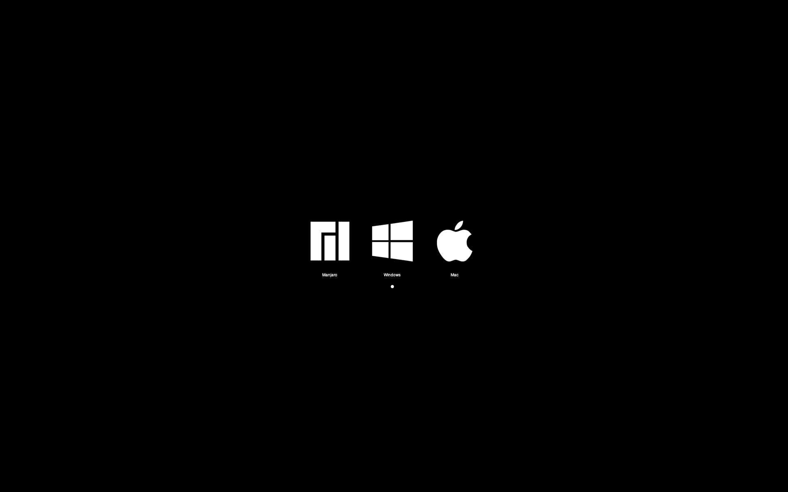

# OpenCore Tips and Tricks



- [OpenCore Tips and Tricks](#opencore-tips-and-tricks)
  - [Change boot entry image](#change-boot-entry-image)
    - [Convert .png to .icns](#convert-png-to-icns)
    - [Change icon](#change-icon)
  - [Rename boot entry](#rename-boot-entry)
  - [Screenshot OpenCore boot menu](#screenshot-opencore-boot-menu)

## Change boot entry image

You need `.icns` files. If you don't have it, first do the convert part and then proceed.

### Convert .png to .icns
1. Download or create your desire icon (256×256 are recommended)
2. Download [Icnspack-Builder](https://github.com/chris1111/Icnspack-Builder)
3. Drag your icons to application and save Resource.zip
4. Extract zip file

### Change icon
1. Mount OS entry EFI drive (for example Linux EFI)
2. Right click EFI drive in Finder and click on `info`
3. Drag .icns to the icon section of info window

Personally I recommend adding padding to icon. It makes it smaller to look good with other icons.

## Rename boot entry
There are lots of way to do this, and it may or may not work for you.

1. Boot into Linux (or use a live version)
2. Open a disk management software and find EFI of the drive that you want to rename (for example `/dev/sda1`)
3. Open Terminal
4. Run this command (change drive address with yours)
    ```
    sudo fatlabel /dev/sdd1 "MyLabel"
    ```


## Screenshot OpenCore boot menu

1. Copy `CrScreenshotDxe.efi` from OpenCore-Release/OC/Drivers to your EFI/OC/Drivers
2. Add `CrScreenshotDxe.efi` as string entry to `config.plist` UEFI/Drivers
3. Go to boot screen and press F10

Screenshots store in root folder of EFI driver.